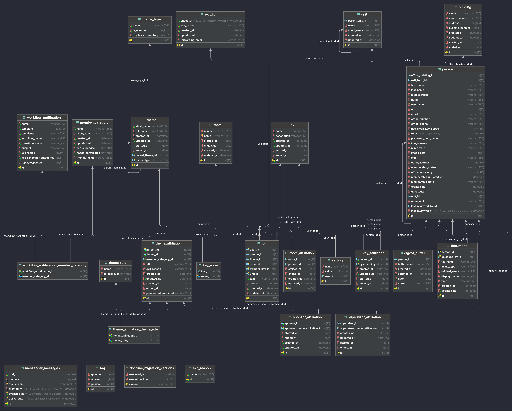

# Introduction

## Overview

IGB CONNECT (Comprehensive ONline Network of Employees, Centers and Themes) is the central repository for all of IGB\'s
personnel information. It will handle on- and off-boarding for all personnel, and tie into several other systems when
applicable. It will be easy-to-use and display useful, targeted information to encourage everyone to use it as intended.
It is our goal in this project to *simplify* everyone\'s work, *not* to add to it.

This spec is not complete. All wording will need to be revised over time, and features will be reworked and expanded
based on iterative user feedback. All characters are fictional, and any similarities to persons past or present is
strictly coincidental.

### Context

The current IGB People Database is out-of-date and not fully used by members of the IGB. Past versions of the People
Database were slow and unresponsive, leading to a current distrust of the system even though it has now been improved.
In addition, the People Database is not tied into any other systems. It does not capture (or does not currently contain)
some of the historical personnel data we need to have access to.

For these reasons, the best course of action is to start fresh with a new system for personnel management. CONNECT,
being a new entity, will hopefully not inherit much of the distrust surrounding the People Database. To further engender
trust, we will be working closely with our future users to ensure CONNECT works in a way that helps all of them.

## Terminology

The product outlined in this document may be referred to interchangeably as CONNECT, the CONNECT application, or the
CONNECT database.

In this document, we will frequently refer to **users** and **members**. A **user** is anyone who logs in to the CONNECT
application for any reason. A **member** is someone affiliated with the IGB, whose information is stored within CONNECT.
All **users** are **members**, but not all **members** are **users**!

We will refer to specific **users** by their **roles**. A **role**
defines what a certain user can do or see within the CONNECT application. In order to ensure the future relevancy of
this document, we will avoid referring to any current users by name, instead using their **role** whenever possible. An
overview of roles is available on page [9](#roles).

Since CONNECT will keep track of **members** both past and present, it will often be necessary to differentiate them. We
will refer to people currently affiliated with the IGB as **active members**, and people no longer affiliated with the
IGB as **previous members**.

We expect CONNECT to be used primarily by a handful of key staff groups, with whom we will be meeting for input, and
from whom we will be expecting the bulk of our feedback. We will refer to these people as the
**stakeholders**.

## Goals

The overarching goal of CONNECT is to act as a central repository for our non-confidential personnel data. It will be an
important resource for several groups within IGB, including Admin, CNRG, and HR.

### Design Pillars

There are four main pillars around which CONNECT will be designed. These are the main points which we will focus on when
considering what features to implement.

#### Pillar 1: Data

As we design CONNECT, we need to consider what sorts of data we will capture about each IGB member. We also need to
consider how that data will be kept and stored in such a way that it can be easily accessed in the future when
necessary. Distinctions must be made between member info for which we must keep historical records (appointment
information, theme affiliation, etc.) and member info for which such detail is unnecessary (home address, NetID, etc.).

#### Pillar 2: Workflows

One of the key aspects of CONNECT will be its many workflows. These workflows will encapsulate the many different ways
IGB members get on-boarded, off-boarded, and everything in between. The main goal of these workflows should be to
simplify and reduce the amount of difficult interaction required while still capturing all the needed data. Working with
the different user groups within IGB will be key in developing useful, simple workflows.

#### Pillar 3: Hooks

CONNECT will be tied into whatever other systems are necessary to improve communication and collaboration about our IGB
members. This includes anything from simple notifications to automation of common tasks, when possible.

#### Pillar 4: Roles

There will be a lot going on in CONNECT. Too much for any one person to handle all at once. Therefore, we must ensure
that the system is designed to tailor the information displayed to *who* the user is and
*what* they need to accomplish.

## Non-Goals

CONNECT is specifically *not* designed to do the following:

- Store any confidential or protected information, including HR data and demographic information

- Duplicate data in existing databases

## Challenges

#### Onboarding

Not all IGB members are currently accounted for. While Faculty/Affiliates are generally well-captured by the current
onboarding process specific to them, and Staff can be well captured by HR or other staff members, it is assumed that
many students or other member types are unaccounted for. A major challenge for CONNECT to be beneficial will be to
ensure that all IGB members are represented in the system.

The current IGB Entry Form is used by any IGB member (Faculty/Affiliates excluded) who enters the IGB via HR or the Key
Manager. Many students who work primarily in the lab spaces may not be captured by this process. Faculty and Affiliates
are onboarded through a separate process which goes through the Director's Office. By unifying the onboarding process so
that it is as similar as possible for all IGB member types, while also allowing onboarding to be initiated by more staff
members
(including Lab Managers, Theme Admins, and Supervisors), we hope to capture close to 100% of all IGB members.

#### Offboarding

The IGB currently has an Exit Form which IGB members are supposed to fill out before they leave. However, there is
currently little to no incentive for our members to complete the exit form. As such, a major challenge will be to
identify when members have actually left. There are a few mechanisms by which we might do this:

- CNRG currently uses password expiration to determine when members have left the IGB. All members are required to
  change their IGB password once per year. If they fail to do so, their account is locked. After six months, locked
  accounts are removed. At this point, for CNRG's purposes it is assumed that the user has left the IGB. However, it is
  entirely possible (and especially with remote work more common at present) that many IGB members do not need or will
  not notice the removal of their IGB account. This method may produce false positives, and results in a delay of up to
  18 months.

- Lab Managers, Theme Admins, and Supervisors will often (but not always) know when members they are responsible for
  leave. Sending requests to at least Lab Managers and Theme Admins at the end of each semester to verify their members
  will hopefully be our primary method for catching exited IGB members. This may result in a delay of up to several
  months, but Lab Managers and Theme Admins will be encouraged to update the system before the end of the semester as
  well. As familiarity and engagement with the system increases, this method should become more efficient.

- One class of IGB member in particular which can be captured more effectively is rotation students - graduate students
  who rotate into one of our labs and may or may not remain here. By including an optional Projected End Date on the
  Entry Form, rotation students can be easily removed after they have left, perhaps after automatically being prompted
  to verify if they are staying.

- The simplest option would be to send a prompt to every IGB member once a year, asking them to click "Yes" if they are
  still an IGB member. This will most likely be seen as a nuisance, but if handled properly might be a workable option.

Additionally, an IGB member exiting needs to trigger a number of events or notifications (depending on the member type)
so that their exit can be properly handled. This process needs to function smoothly whether the member will leave in the
near future, has recently left, or has been gone for an extended period of time.

#### Engagement

The current People Database has a major issue with engagement. It is used by only a handful of people in the IGB and is
either entirely unknown or seen as not useful or difficult to use by the rest. A key aspect of the usefulness of CONNECT
will hinge upon the right staff members engaging with the system. As such, we plan to meet with all affected parties (
the "stakeholders") before, during, and after development to ensure that we understand and are meeting their needs, that
they understand CONNECT's purpose and importance, and that we are creating the best possible product for everyone
involved.

## Impact

TBD

# Proposed Solution

CONNECT will be a web application accessible to some subset of IGB staff. Users will log in with their IGB username and
password. Some users will be assigned roles which will allow them to add, remove, or edit IGB members. In addition,
different information in each IGB members' record will be visible to different roles.

The information stored about each IGB member will be, for the most part, limited to basic directory information (name,
office, email, phone number, etc.). Each IGB member's theme affiliations, supervisors, and home units will be stored as
well, in such a way that records will be kept of all past affiliations and supervisors, so that reports can be generated
when necessary. A few other incidental data will be stored as well, such as training certificates and cylinder key
allocation.

The process of onboarding, offboarding, and updating the status of IGB members will be streamlined by the implementation
of various workflows. These workflows will allow users to quickly and easily perform common tasks based on their roles.
Of course, the ability to edit member information will always be available when necessary (as long as a user's role
allows it).

CONNECT will be connected to a number of other IGB services in order to streamline any common personnel-related tasks in
existing systems. When systems cannot be easily connected to CONNECT, a simple notification system will fill in those
gaps either temporarily or permanently.

## Analysis

### Pros/Cons

By designing a system ourselves, we can ensure it fits the needs of the IGB by working very closely with the involved
stakeholders and provide long-term support for however the needs of the IGB may change. The major drawback is of course
the development time and manpower required to create a system from scratch. However, it also eliminates any time which
would be required to adapt an off-the-shelf solution to our needs, or adapt our procedures to fit an off-the-shelf
solution (if indeed that would be possible).

### Costs

TBD

### Justification

TBD

## Description

### Data Structure

**Design Note** Some fields (e.g., phone, home address) we do not need history, but many fields we do. For some fields a
detailed log may be enough, for some we will need to actually have data structures to keep track of their history.

- Person
    - Name (First/last/middle initial)
    - NetID
    - IGB username (this can be different from NetID in some cases!)
    - UIN
    - Photo
    - Email address
    - IGB Office Room number (multiple concurrent rooms possible) (Follow up w/Jesse about room numbers)
    - IGB Office phone number
    - Primary campus address
        - Could be the same as IGB office, or not
    - Unit (multiple, historical)
        - Position in unit (e.g., Associate Professor, Graduate Student, etc.)
    - Theme Affiliation (multiple, historical)
        - Role (e.g., Faculty/Affiliate/Fellow/etc.)
        - Start Date
        - End Date
    - Supervisor (multiple, historical)
    - Keys (multiple, historical)
- Theme
    - Short name
    - Full name
    - Leader (historical)
    - Non-research (some themes, such as ADM or possibly a \"core users\" theme, are administrative and not research
      themes, and shouldn\'t be included in statistics)
- Unit
    - Name
    - Parent Unit

**Tech Note** IGB Staff fall under a special \"theme\" called \"Administration\" (ADM).

### Hooks

#### LDAP Accounts

- When an IGB member enters, we can automatically create their LDAP account.

- Supervisors can add or remove access to their group folders to/from the people they supervise.

- When an IGB member exists, we can automatically set their LDAP account to expire in 6 months.

#### Mailing Lists

- On entrance or role change, add the person to the appropriate mailman list (e.g., faculty get added to the faculty
  mailing list, affiliates to the affiliate mailing list, etc.)

- All IGB members get added to the master list on entry.

- Theme members get added to the theme mailing list on entry to the theme and removed on exit from the theme.

- On exit, remove the person from all mailman lists.

#### IGB Website

- On entrance or directory information change, update the IGB website directory.

- On exit, remove the person from the IGB website directory.

#### Core

- CONNECT should communicate with the Core billing service when Core users come and go. It is unclear at this time in
  which direction that communication should go, and what status exactly Core users should have in CONNECT.

#### Keys

- On entrance and exit, the key manager will be notified by email about any keys/card access that needs to be given. Key
  information will be logged in each user's record by the key manager.

#### Notifications

- Email notifications can be configured to be sent for a variety of different "events," such as IGB member
  entrance/exit, the updating of various types of records, etc. Examples include:

- When an IGB staff member enters the IGB, a welcome email is sent with new employee information.

### Roles

Roles will define which users have access to various segments of the application, to read or write certain user data, or
to receive various notifications. These roles are not mutually exclusive; any user can have multiple roles (or none).

CONNECT Roles are as follows:

- CONNECT Admin -- Superusers who can access all aspects of CONNECT. This has no relation to Theme Admins or other Admin
  Staff.

- Theme Admin -- Administrative staff for each theme. This role will be tied to a specific theme for each user, i.e.,
  each Theme Admin will potentially have special privileges within and receive notifications about their theme, but not
  all themes.

- Lab Manager -- Theme lab managers. Like Theme Admins, this role is tied to a specific Theme.

- Certificate Manager -- The certificate manager approves lab training certificates (currently the IGB receptionist)

- Key Manager -- The Key Manager controls access to cylinder keys within the IGB and maintains a list of what keys each
  member has.

### Member Types

- Civil Service

- Academic Professional

- Academic Hourly

- Extra Help

- Faculty

- Affiliate

- Graduate Student

- Undergraduate Student

- Visitor/Visiting Scholar

- Research Staff/Specialist

- Post Doc

- Fellow

- Volunteer

- Non-IGB Member -- This includes any people we need to have in our system who are not IGB members, including core
  facility users and members of affiliated organizations (e.g., Carver Biotech Center, iSEE, etc.).

### Workflows

The details of our workflows are at this time covered in a separate document (see Scenarios.docx and
Workflow.Staff.09162021.pptx).

The individual steps of each workflow will be stored in the database so that they can be modified relatively easily
without reprogramming anything (when possible).

#### New Member Workflow

There are three entry points to the new member workflow:

1. HR or Op/Fac creates the new member (very briefly including name and username). Their LDAP account is automatically
   created and they are sent a link to sign in and complete the entry form.

2. HR or Op/Fac enters the new members' email to send a unique one-time registration link. The new member can use that
   link to access their entry form

3. HR or Op/Fac can bring up an entry form and allow the new member to fill out the form in person.

However the workflow was initiated, it continues as follows:

- The new member fills out the entry form and submits it

- A message is sent to their lab manager or theme admin for approval

- The approver clicks a link in the email to view the entry form and approve it, with the option to correct it if
  necessary

- A welcome email is sent to the new member with information and instructions on what to do next, including a link to
  upload their training certificates

- The new member completes necessary trainings and receives certificates

- The new member uploads their certificates to their CONNECT profile

#### Member Exit Workflow

TBD

### Reports

TBD

#### Personnel Listings

A current listing of all personnel, optionally filtered somehow, e.g., by theme, physical location, member type, etc.

# Technical Specification

## Technical Requirements

The CONNECT web application and database will both be deployed in a VM on our existing vmfarm system, with a proxy from
our existing www-app server. Development will be performed on existing hardware. Development and staging servers will be
set up on existing hardware. No additional hardware resources should be required for development or deployment.

## Technologies Leveraged

Business logic will be implemented using PHP 8.1 in the Symfony 6 framework.

Data will be stored in a MariaDB 10.6 server.

The frontend will be built using HTML5/CSS3, using the Bootstrap 5 CSS framework, the jQuery 3 JavaScript library, and
the Twig 3 template engine.

Downloadable reports will be generated using the PHPSpreadsheet library \[https://github.com/PHPOffice/PhpSpreadsheet\]

## Technical Pros/Cons

With PHP 7 going EOL at the end of 2022, it\'s time to start looking ahead to PHP 8. Symfony 6 requires PHP 8.1
specifically. This means we will have to set up a VM with PHP 8, rather than using one of the available PHP 7 versions
on www-app; however, this is a worthwhile VM to set up which may benefit future projects (PHP 8 isn\'t going anywhere).

Symfony is a PHP framework which makes it easy to rapidly set up full-featured websites. Using a framework allows us to
spend our time working on the task at hand rather than reinventing the wheel, so to speak. Symfony is free and
open-source, has a large and active community, and has lots of available support and documentation. While some may
assume that using a framework creates a barrier to others who may need to support or modify the code, using Symfony
creates relatively easy-to-read, well-organized code. While there is, of course, a learning curve involved, it is a
fairly shallow one.

HTML5 and CSS3 are industry standards for web front-ends. Bootstrap and jQuery are very widely used both within the
industry and within CNRG. Twig will allow us to create easy-to-read frontend code, has been adopted to a certain extent
in other projects in CNRG, and is the built-in template engine in Symfony.

## Data Model

### Schema

#### Person

- firstName (string)
- lastName (string)
- middleInitial (string)
- netid (string)
- username (string)
- uin (integer)
- email (string)
- officeNumber (string)
- officePhone (string)
- officeBuilding (OneToMany, Building)
- otherAddress (text)
- preferredAddress (Boolean)
- offerLetterDate (date)
- keyDeposit (Boolean)
- unitAffiliations (OneToMany, UnitAffiliation)
- themeAffiliations (OneToMany, ThemeAffiliation)
- supervisorAffiliations (OneToMany, SupervisorAffiliation)
- superviseeAffiliations (OneToMany, SupervisorAffiliation)
- roomAffiliations (OneToMany, RoomAffiliation)
- keyRelation (ManyToOne, KeyAffiliation)
- slug (string)
- roles (string)

#### MemberCategory

Member types will be defined in the database, rather than as constants, so that new member types can be created
on-the-fly, if necessary, in future. This also allows us to easily define workflow associations with various member
types.

- name (string) -- e.g., Graduate Student
- shortName (string)
- memberCategoryAffiliations (OneToMany, MemberCategoryAffiliation)

#### Theme

Uses HistoricalEntityTrait

- shortName (string)
- fullName (string)
- isNonResearch (boolean)
- isOutsideGroup (boolean)
- themeMembers (OneToMany, ThemeAffiliation)

#### Building

- name (string)
- shortName (string)
- address (text)
- buildingNumber (integer)

#### Room

Rooms will be associated with people (i.e., for office numbers) and with keys (each key opens one or more rooms).

- number (string)
- name (string, optional)

#### RoomAffiliation

Uses HistoricalEntityTrait

- room
- person

#### Key

- rooms (ManyToMany, Room)
- name (string) -- e.g., A, GM1, TBBC21
- description (string) -- e.g., Server Room Key, CNRG Office Key
- keyAffiliations (OneToMany, KeyAffiliation)

#### KeyAffiliation

Uses HistoricalEntityTrait

- person (ManyToOne, Person)
- key (ManyToOne, Key)

#### Unit

- name (string)
- shortName (string)
- parentUnit (ManyToOne, Unit)

#### ThemeAffiliation

Uses HistoricalEntityTrait

- person (ManyToOne, Person)
- theme (ManyToOne, Theme)
- memberCategory (ManyToOne, MemberCategory)

#### ThemeLeaderAffiliation

Uses HistoricalEntityTrait

- person (ManyToOne, Person)
- theme (ManyToOne, Theme)

#### SupervisorAffiliation

Uses HistoricalEntityTrait

- supervisor (ManyToOne, Person)
- supervisee (ManyToOne, Person)

#### UnitAffiliation

Uses HistoricalEntityTrait

- person (ManyToOne, Person)
- unit (ManyToOne, Unit)

#### HistoricalEntityTrait

- startedAt (date)
- endedAt (date)

#### Log

Uses TimestampableEntity

- user (ManyToOne, Person)
- message (string)
- person (ManyToOne, Person)
- theme (ManyToOne, Theme)
- room (ManyToOne, Room)
- key (ManyToOne, Key)

#### WorkflowNotification

- name (string)
- template (string)
- recipients (string)
- workflowName (string)
- transitionName (string)
- subject (string)
- isEnabled (boolean)

### Validation

TBD

## Data Import

CONNECT will pull its initial data set from a number of different sources, and that data will need to be prepared and
imported into the database. This process will be designed to be simply executed, since the import process will need to
be repeated several times as different stages of CONNECT come online.

### People Database

The People Database presently contains our most up-to-date information about people at the IGB. This is currently kept
up by IGB reception. We will import most of our information from here.

### Faculty/Affiliate Spreadsheet

The IGB Director's Office keeps a spreadsheet of all past and present IGB faculty and affiliates. We will use this
information to supplement (or correct) any information from the People Database.

### IGB Room Listing

F&S has a list of all rooms in the IGB, which we will import.

### Key Spreadsheet

IGB reception keeps a spreadsheet of the keys which have been issued. We will import this spreadsheet to associate keys
with members.

## Business Logic

TBD

#### Logging

Whenever a member\'s information (or a theme, key, room, workflow, or any affiliation) is modified, the event must be
logged. The associated entity, along with the user who made the change, the time, and a detailed description of the
modification must be logged.

To this end, a logging service will be created to facilitate the creation of Log objects whenever a corresponding event
occurs.

#### Historicity

All entities which use HistoricalEntityTrait will need a common set of simple querybuilders to fetch entities which are
current or past. To that end, there will also be a HistoricityManager which will help in dealing with these entities.

#### Access Control

We will need some basic access controls for:

- Documents: Only theme admins, lab managers, and other admins can view documents attached to a member's record.
- Approvals: Only certain people can approve certain steps of the membership workflow. I.e., theme admins and lab
  managers can approve entry and exit forms, while the receptionist has to approve training certificates.
- Editing: Only theme admins, lab managers, and other admins can edit a member's information.

#### Workflow System

We will leverage the Symfony Workflow system, which will handle the workflow structure and the mechanics of
transitioning. Each workflow transition can have any number of associated notifications.

## Workflows

### Membership Workflow

#### Entry Form

During this step we are waiting for the entry form to be completed. Once the user submits their entry form, the step is
complete.

#### Entry Form Approval

In this step, the new member\'s lab manager/theme admin must review and approve the member\'s entry form. At the
beginning of the step, a notification is sent to the approver.

#### Training Certificates

In this stage, the new member must upload all required training certificates. At the beginning of the step, the new
member is sent a notification with instructions concerning their training certificates.

#### Certificate Approval

IGB reception must approve the uploaded training certificates. After this, the IGB member is active and no further
action is required of them.

#### Exit Form

When the IGB member is preparing to leave the IGB, they will submit a simple exit form. Information on their
responsibilities before leaving will be sent to the member at this time.

#### Exit Form Approval

The member's theme admin or lab manager will approve their exit form.

## Presentation Layer

In this section, we will describe all the view layouts necessary for CONNECT. Wireframes are available in the CONNECT
Wireframes Adobe XD file.

### Basic Member Views

These are basic views which allow users to display or manipulate member information. There will be more specialized
views (e.g., for workflows, or for certain user roles) described later.

#### Member Index

A list of all active IGB members. We will use Datatables for quick sorting and filtering. Users need to be filterable by
theme, employee type (or theme role), and searchable by name and title. The table should display name, theme, employee
type, room number. There should also be an option to include previous IGB members in the table. The columns should
change based on the role of the user, e.g., CNRG members would want to see username, but that wouldn\'t be helpful for
other roles.

All IGB members are visible to all users.

If the table ends up being unresponsive once all the users are in the database, we may have to come up with a better
solution.

#### Member View

A page to display all of an IGB member's information as stored in the database. The basic view, visible to everyone,
will include all basic information such as name, room, employee type, theme affiliations, supervisor, email, office
phone. This page will also include separate tabs for some roles: The Key Manager will have a tab to display the keys a
user has. User roles with access to edit member information will see a link to edit the information on this page. There
will be additional links to set trainings as completed, add/remove themes and supervisors, change the member type, and
add notes.

#### Member Edit

An extensive form in which all member information can be added or edited. There are also various simpler ways to edit
bits of member information for convenience, but this is the big form where anything can be changed.

Form Fields:

- First Name (text)
- Last Name (text)
- Middle Initial (text)
- NetID (text)
- IGB Username (text)
- UIN (text)
- Email (email)
- Office Number (text)
- Office Phone (phone)
- Office Building (dropdown, defaults to IGB)
- Home Address (textarea)
- Campus Address (text)
- Campus Address Preferred (checkbox)
- DRS Training Complete (checkbox)
- IGB Training Complete (checkbox)
- Units (dropdown, multiple)
- Offer Letter Date (date)
- Key Deposit (checkbox)
- Themes (collection)
    - Theme (dropdown)
    - Member Type
    - Theme roles (dropdown)
    - Start (date)
    - End (date)
- Supervisors (collection)
    - Supervisor (dropdown)
    - Start (date)
    - End (date)
- Roles (dropdown, multiple)
- Keys (dropdown, multiple, only visible to key manager)

#### Add Theme Affiliation

A simple form which handles adding a theme affiliation to the member. Contains a dropdown with the possible themes, with
current themes disabled, a start date field, a member category dropdown, and an optional checkbox to end current theme
affiliations when adding the new one.

#### End Theme Affiliation

A simple form which ends a given theme affiliation. Contains an end date field (defaulting to the current date).

#### Add Supervisor

A simple form which handles adding a new supervisor to the member. Contains a dropdown with possible supervisors,
current supervisors disabled, a start date field (defaulting to current date), and an optional checkbox to end current
supervisor affiliations.

#### Remove Supervisor

A simple form to remove a supervisor from the member. Contains an end date field (defaulting to the current date).

#### Edit Keys

A simple form for the Key Manager to add or remove keys to/from the member. Contains a multi-dropdown with all available
keys.

#### Add Note

A simple form to add a note to the person\'s file. Contains a textarea for the note itself and radio buttons to select
the note visibility.

### Theme Views

#### Theme Index

Displays a list of all themes, with name, dates, and number of members.

#### Theme View

Displays the information about a given theme. Includes full name, dates, and a list of members.

### Membership Workflow Views

#### Entry Form

The new member form. Based mostly on the existing physical entry form. This is based on the Member Edit form, but with
some fields removed.

Form Fields:

- First Name (text)
- Last Name (text)
- Middle Initial (text)
- NetID (text)
- UIN (text)
- Email (email)
- Office Number (text)
- Office Phone (phone)
- Office Building (dropdown, defaults to IGB)
- Campus Address (text)
- Unit (dropdown)
- Theme (dropdown)
- Start (date)
- End (date, optional)
- Supervisor (dropdown)
- Member Type

#### Approval Index

This page displays to an approver (theme admin, lab manager, receptionist, etc.) the list of all members waiting for
approval.

#### Entry Form Approval

This page displays the information entered in the entry form for the new member\'s approver. The form can optionally be
returned for correction before approval.

#### Training Certificate Upload

This page allows a new member to upload their training certificates.

#### Certificate Approval

This page provides links to download and review the uploaded certificates. As with the entry form, they can be returned
for correction before approval.

### Administrative Views

These views will allow CONNECT administrators to view and update various CONNECT settings. The administrative views will
be facilitated by the EasyAdmin bundle, which will make their setup much faster. Each page will allow administrators to
create, view, edit, and delete entries of the corresponding type.

The following entities will be accessible in the administrative backend:

- People (only viewable, editing must be done in the main site)
- Units
- Member categories
- Keys
- Key assignments
- Rooms
- Themes
- Buildings
- Workflow notifications
- Miscellaneous settings

## Future Requirements

TBD

## Testing

In May 2023, we will soft launch Connect for the theme admins and lab managers. They will use the site throughout the
summer in advance of our launch in August. During this time, they will audit the information imported into Connect for
accuracy and test the entry/exit functionality. In June, we will enable email notifications and continue testing.

# Further Considerations

## Alternate Solutions

#### Off-the-shelf solutions

A number of off-the-shelf solutions were considered. There are two chief concerns about such solutions.

First, the commercial personnel systems considered are designed with far more features than what we're looking for, such
as vacation tracking, shift management, and HR management. They are designed to be full self-service employee portals,
which is far outside the scope of what we are looking for. Since user engagement is one of our major challenges, we need
to make sure our solution is as user-friendly and easy-to-use as possible. A "kitchen-sink" approach will only cause
confusion.

Second, the commercial personnel systems available are geared towards private businesses, rather than a university
setting. Even if it were possible for us to take advantage of some of the more advanced features of these systems, we
would need to adapt them to ensure they conform to the rules of the University and the special needs of the IGB.

Other more minor concerns with commercial personnel databases include the associated costs, long-term support
considerations, and adaptation time.

#### Simpler Database Software

Simpler databases (e.g., Microsoft Access, Filemaker) might do very well for storing the data we need to keep track of,
writing reports, and even processing entry and exit forms. However, a major component of CONNECT is its ability to be
tied into other systems at the IGB, either directly or through notifications. While simple email notifications are
possible in Access and Filemaker, some of the more advanced connections we would like to make would not be possible.

There are also concerns with ease of access; Access is not available for macOS, and neither program is available for
Linux operating systems; furthermore both would require accessing a database file on a shared drive, which adds another
layer of complexity to accessing the database. By creating a web application instead, we ensure that CONNECT is easy to
access for everyone, no matter where they are or what device they're using.

Finally, there are long-term support considerations when using a commercial database program like Access or Filemaker.

## Future Ideas

The following are a brief list of ideas which we might one day use CONNECT for, which are out of scope for the initial
version of the product for various reasons. Nonetheless, we should design the system with some of these ideas in mind to
ensure that if and when we do want to implement them it is easy to do so.

#### Building Directory

Since all directory information will be housed within CONNECT, it could be used to power directory signage.

#### Inventory Management

In future, if inventory was tied to its owners within CONNECT in some way, that could be hugely beneficial to both CNRG
and Facilities. For CNRG, being able to see at-a-glance what type of equipment someone has when a help request comes in
would potentially improve the efficiency of the helpdesk. The biennial inventory process could also be potentially
streamlined by having IGB members' inventory information more readily accessible.

## Scale Considerations

IGB members will continuously be added and never removed. However, we expect this to be a linear process, with an
approximately constant number of members added each year. There is an active member base of approximately 1500 people (
based on the current number of LDAP users). Most day-to-day operations will only apply to the active member base, and so
for these operations scaling should not be an issue. Reports and other operations that act on the whole database --
including previous members -- will be less frequent. With the data stored being relatively simple, scaling is not
expected to be an issue for these situations for many years to come.

To keep the number of active users relatively constant, special consideration needs to be taken for offboarding users (
see Offboarding).

## Security Considerations

Concerns were expressed by our stakeholders about fake or spam account creation. The entry form will only be accessible
to actual IGB members, either via a one-time code or by logging in to their account.

## Privacy Considerations

Some concerns have been expressed by our stakeholders concerning the privacy of some of their more personal
information (home address, home phone). As such, these data will be restricted to supervisors and user roles with
specific access to those data.

## Accessibility Considerations

TBD

## Support Considerations

Long-term support requirements should be fairly minimal and can be handled in-house. Support would be necessary only in
the case of bug fixes or necessary server updates, or when implementing new requested features (although that is beyond
the scope of this document).

# Work

## Milestones

#### Functional/Technical Specification drafts

Data structures, basic user scenarios, and workflows will all be worked out as best as possible. For this milestone, Joe
will be primarily working on the technical spec while Darci compiles user stories and outlines workflows.

In progress as of 9/16/21.

#### Preliminary meetings w/ stakeholders

We will meet with all applicable stakeholders to clarify our draft scenarios and workflows. This includes, but is not
necessarily limited to: HR, CNRG, Operations and Facilities, Director's Office, Theme Admins, Lab Managers, and
Communications.

In progress as of 10/6/21, complete as of 2/1/22.

#### Basic database functionality

The data structures and basic functionality of the web application will be implemented. This "basic functionality" means
CRUD (Create, Read, Update, Delete) for all information. Specific workflows or hooks will not yet be implemented, but
the system will be built in such a way as to facilitate their later addition. This will act as a foundation for the rest
of the project.

Deliverables:

- Data structures
- Basic style template
- Logging service
- Basic member views
- Admin views
- Login/security system
- Access control systems

In progress as of 2/15/22, complete as of 4/1/22.

#### Data import

The procedures for importing data into CONNECT from our existing data sources will be implemented.

Deliverables:

- Data import procedures
- Import initial staff data
- Import IGB data (keys, rooms, themes, etc.)

In progress as of 2/1/22, complete as of 7/6/22.

#### Staff-related workflows implemented

The base workflow system and entry/exit workflows for staff will be implemented.

Deliverables:

- Base workflow system
- Workflow admin views
- Staff entry workflow hooks
- New member workflow views
- Staff exit workflow hooks
- Staff exit workflow views

In progress as of 9/26/22, complete as of 3/21/23.

#### TBD

More milestones to be determined

# Miscellany

## Open Questions

- Can we get iCard photos automatically?
- Can we connect to the business copier?

## References

#### Documentation

- Symfony Framework - <https://symfony.com/>
- Twig - <https://twig.symfony.com>
- VichUploaderBundle - <https://github.com/dustin10/VichUploaderBundle>
- EasyAdmin - <https://symfony.com/doc/current/EasyAdminBundle/index.html>
- symfonyCollectionJs -
  <https://github.com/ruano-a/symfonyCollectionJs>
- Bootstrap - <https://getbootstrap.com>
- Font Awesome - <https://fontawesome.com/>

#### Data Sources

- Building list -
  <https://fs.illinois.edu/about-us/building-list-by-building-number>

- School/College list - <http://catalog.illinois.edu/schools/>

## Acknowledgements

We are extremely grateful to Amy Ahmed, Mindy Baughman, Mary Callaway, Mike Choi, Nikki Gentry, Gabriel Horton, Jacinda
King, Kathy Millage, Beth Penner, Jess Quicksall, Jessica Smith, Jesse Southern, and Nick Vasi for spending time working
together with us during the design process.
